# 🚕 Rideshare App
## 📚 Table of Contents
1. [Phase 1 – System Context & Requirements Analysis](#phase-1--system-context--requirements-analysis)
2. [Phase 2 – Interaction Modeling (Use Case & Sequence Diagrams)](#phase-2--interaction-modeling-Use-Case--Sequence-Diagrams)
3. [Phase 3 – Structural Modeling (Class Diagrams & Data Design)](#phase-3--structural-modeling-Class-Diagrams--Data-Design)
4. [Phase 4 – System Architecture & UI Design](#phase-4--system-architecture--ui-design)
5. [Setup & Installation](#setup--installation)
6. [Technologies Used](#technologies-used)
7. [Team & Credits](#team--credits)

---

## Phase 1 – System Context & Requirements Analysis

<summary><b>🔍 Problem Statement</b></summary>
 
- Many people struggle to afford taxis because of high prices.
- There is a need for a more affordable and reliable mode of transportation for daily commuters.
- The system will help users find nearby drivers, compare estimated fares, and choose the most cost-effective option.
- Overall, the goal is to make local travel more convenient and budget-friendly while reducing traffic and fuel use.

<summary><b>🎯 Project Scope</b></summary>
  
- ✅ The application will include core features such as user registration, ride booking, fare price estimate, ride tracking and payment options.
- ✅ It will focus on short-distance daily travel within cities and towns.
- ✅ The system will support basic user and driver profiles, ride sharing between multiple users, and secure payment methods.
  
- 🚫 Out of scope are advanced navigation systems, loyalty programs, multi-city expansion. 

<summary><b>📘 Context Diagram</b></summary>

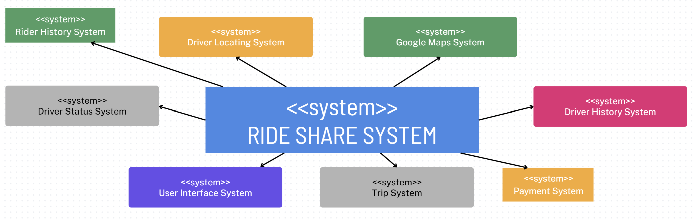

<summary><b>⚙️ Functional Requirements</b></summary>

| # | Requirement | Description |
|---|--------------|-------------|
| FR1 | User Profile Creation | Users should be able to create a personal profile. |
| FR2 | Ride Booking | Users should be able to book a ride to a destination. |
| FR3 | Driver Matching | When users book a ride, they should be matched to the nearest available driver. |
| FR4 | Ride Pricing & ETA | Users should be able to see the estimated fare and arrival time before booking. |
| FR5 | Live Ride Tracking | Users should be able to track the real-time location of their driver. |
| FR6 | Ride Cancellation | Users should be able to cancel a ride before pickup. |
| FR7 | Payment Options | Users should be able to pay using multiple methods (credit card, PayPal, Apple Pay, etc.). |
| FR8 | Ride Rating | Users should be able to rate their ride and driver after completion. |

<summary><b>🧩 Non-Functional Requirements</b></summary>

| # | Requirement | Description |
|---|--------------|-------------|
| NFR1 | Security | Implement a minimum password policy and multi-factor authentication (MFA) to secure user accounts. |
| NFR2 | Data Protection | Encrypt all sensitive data both at rest (TDE) and in transit (TLS encryption). |
| NFR3 | Performance & Efficiency | Ensure continuous testing and minimize unnecessary resource utilization (e.g., duplicate data) to maintain stable performance under increased user loads. |
| NFR4 | Reliability & Monitoring | Integrate real-time crash reporting to capture detailed diagnostic data and improve system reliability. |
| NFR5 | Availability | Maintain highly reliable systems to ensure uptime and accessibility for all users. |
| NFR6 | Maintainability | Regularly update and maintain databases, codebase, and documentation to ensure long-term system sustainability. |

---

## Phase 2 – Interaction Modeling (Use Case & Sequence Diagrams)

<summary><b>📘 Use Case Diagram</b></summary>

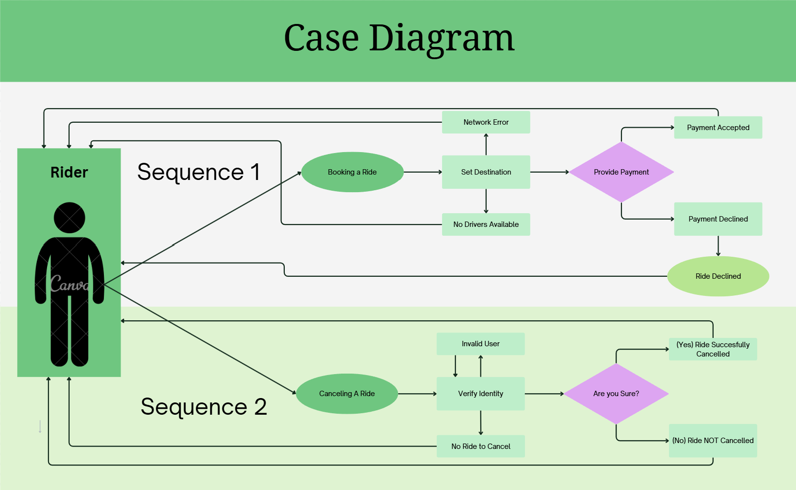

**Description:**  
- Actors: Rider, Driver, Trip System, Payment System
- Description: Rider may book a ride by setting destination, ride can be accepted by driver or fail for network reasons or unavailable drivers. Ride is successful or unsuccessful from payment failure. 
- Data: Rider location/destination, Payment method
- Stimulus: User command issued by Rider User
- Response: Ride Approved
- Comments: Rider must have adequate internet connection and valid payment method

**Description:** 
- Actors: Rider, Trip System
- Description: Rider may cancel a ride through the trip system, user authentication needed before confirming and current trip must be verified with rider history. Ride cancellation is either successful or failed.
- Data: Rider trip history
- Stimulus: User command issued by Rider User	
- Response: Ride cancelled
- Comments: Rider must have appropriate authentication, and have an active ride available to cancel.

<summary><b>📗 Sequence Diagrams</b></summary>

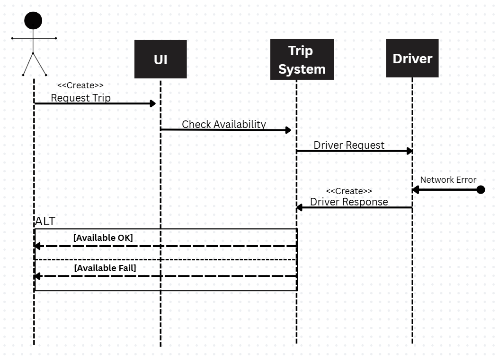

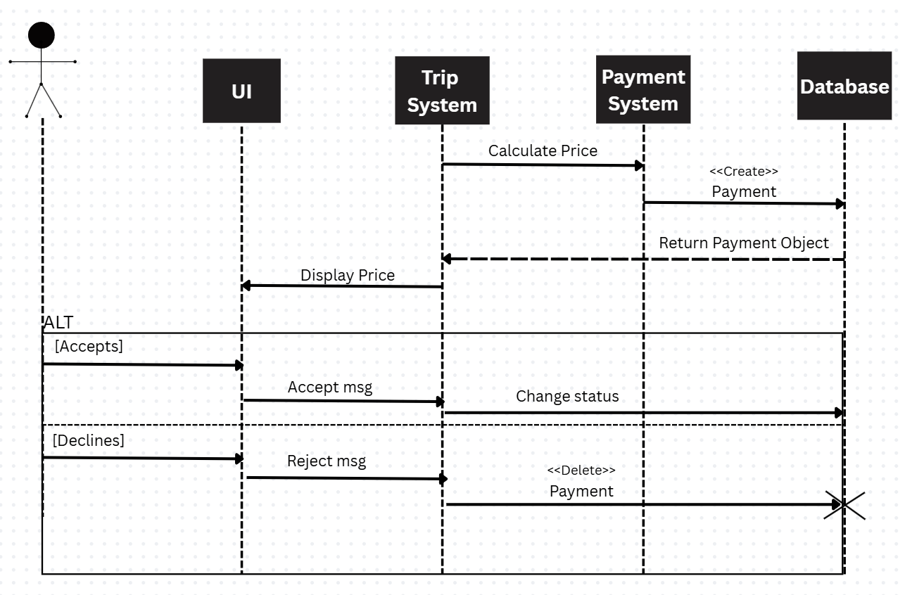

---

## Phase 3 – Structural Modeling (Class Diagrams & Data Design)

<summary><b>📊 Class diagram / Attribute Tables</b></summary>

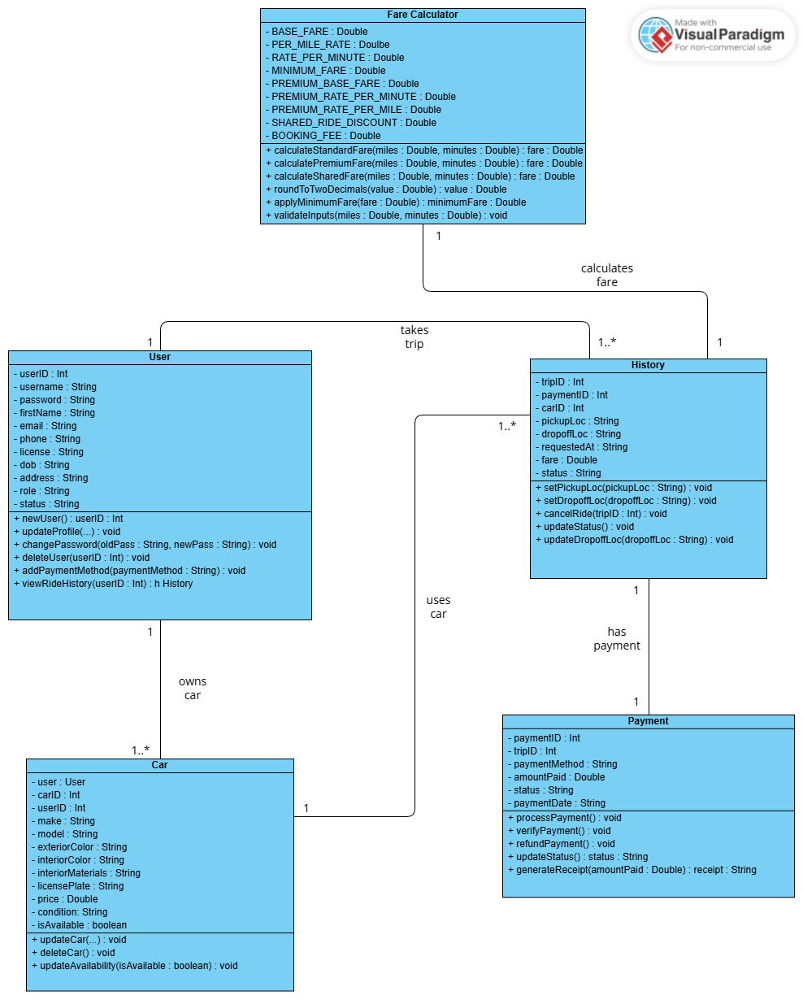

<summary><b>🧱 Database Schema</b></summary>

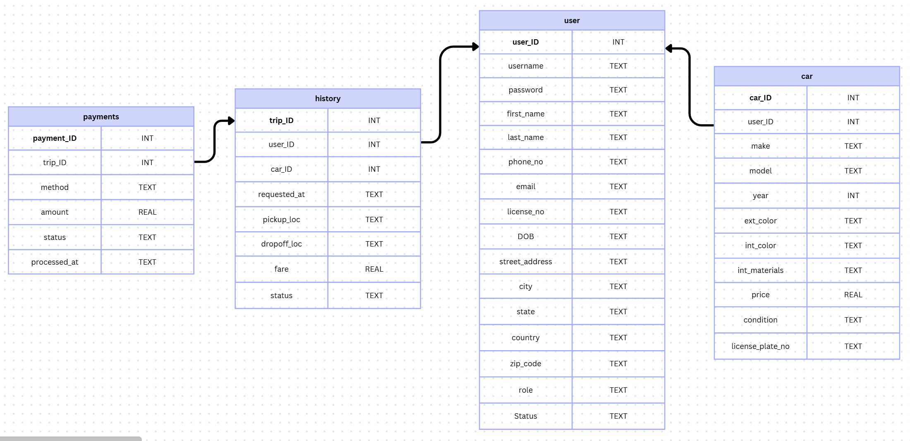

<summary><b>🕸️ Database Entity Relationship Diagram</b></summary>

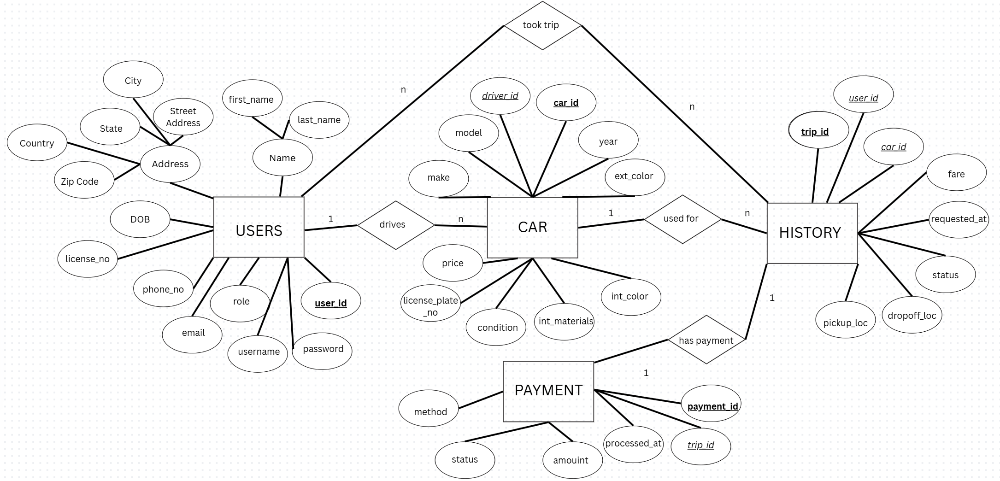

---

## Phase 4 – System Architecture & UI Design

<summary><b>🧭 Architectural Diagram</b></summary>

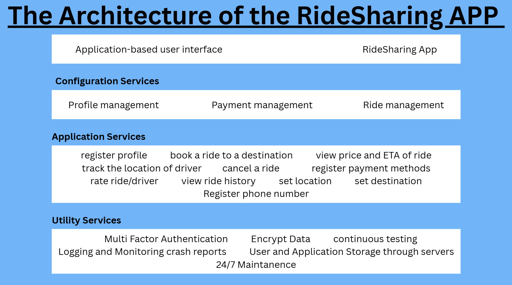

**Application-based user interface:**  
- **RiderSharing:** Main front-end of the application that renders the user interface and sends users actions to the Services Layer.  
- **Rider App:** This is the interface for Riders to request trips, view ETA, track requested driver, manage payments and review trip history.  
- **Driver App:** This is the interface where the Drivers can accept, request, check Rider destination, manage availability and review earnings.
- 
**Configuration Services:**
- **Profile management:** Responsible for creating, editing and retrieving  the Driver’s and Rider’s profile menu including the storage of this data.
- **Payment Management:** Responsible for all financial transitions which includes securing payment method, calculating final fares, handling payment processing, managing refunds and generating receipts.
- **Ride/Trip Management:** Responsible for the entire lifecycle of a ride or trip. From initial request processing, driver accepting request, real-time location tracking, state transitions (eg. from request -> accepted -> in route -> dropped off) and confirmation of final trip destination from rider.

**Application Services:**
- **Register Profile:** Handles the creation of a new user (rider or driver). Records essential information such as name, contact info, and credentials.
- **Register Phone:** Adds or updates the user’s contact info.
- **Set Current Location:** Handle the geocoding and translating user inputs like addresses into standard geo coordinates.
- **Book Ride/Trip Destination:** Handles the accepted ride request by pairing rider with closest available driver, processes route details (e.g. origin, destination, fare estimate and time).
- **View ETA and Trip Pice:** Calculates and displays estimated arrival time for the driver and ride fare based on distance.
- **View Ride/Trip History:** Servers the users a chronological formatted list of completed and/or canceled trips with details (e.g. fare, date/time, driver/car information and payment information).
- **Track Location of Driver:** Provides GPS updates on driver location for rider to view their approach in real-time.
- **Cancel a Ride:** Perform a cancellation of a requested trip and apply any relevant business cancellation fees.
- **Register Payment Methods:** Responsible for associating payment info to a user profile, as well as, securely tokenize, validate and safely store the info.
- **Rate Rider/Driver:** Collects post trip feedback and ratings.

**Utility Services:**
- **User & Application Storage:** Responsible for the persistent data and handles the direct interaction with the database.
- **Data Encryption:** This service is dedicated to securing data in transit (via TLS) and at rest (via SHA-2). Giving special attention to payment info and PII.
- **MFA (Multi-Factor Auth):** A security utility that integrates with Profile Management to enforce and manage secondary verification factors during logins or requests of sensitive nature.
- **Logging & Monitoring Crash Reports:** Service used by all layers to record operational events, system errors, performances and application crashes for diagnostic and debugging purposes.

<summary><b>🖼️ UI Mockups / Screenshots</b></summary>

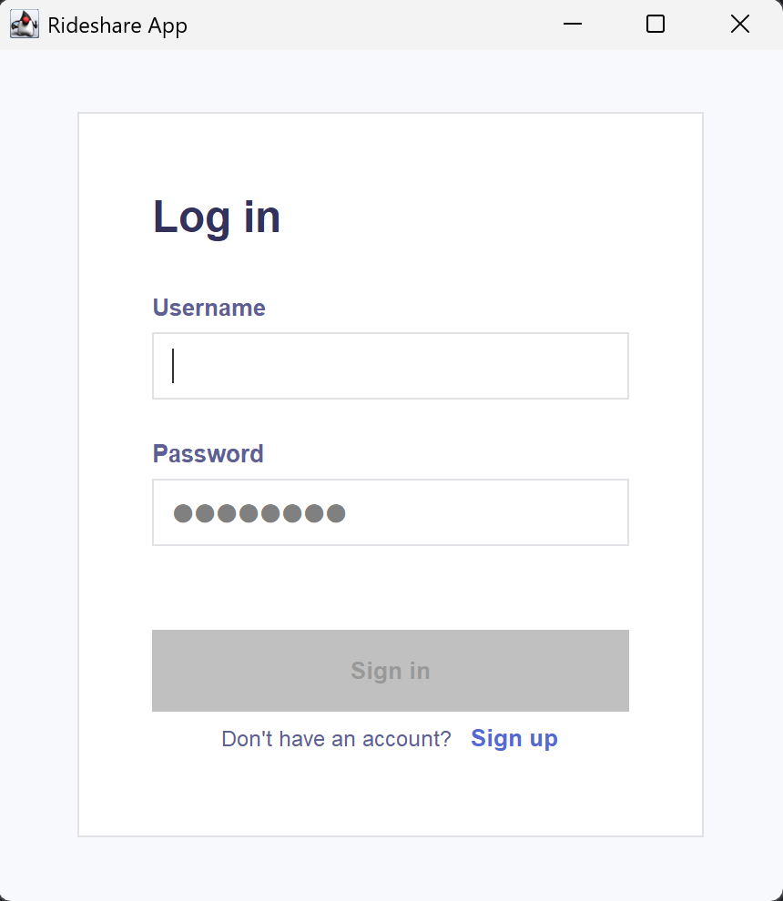
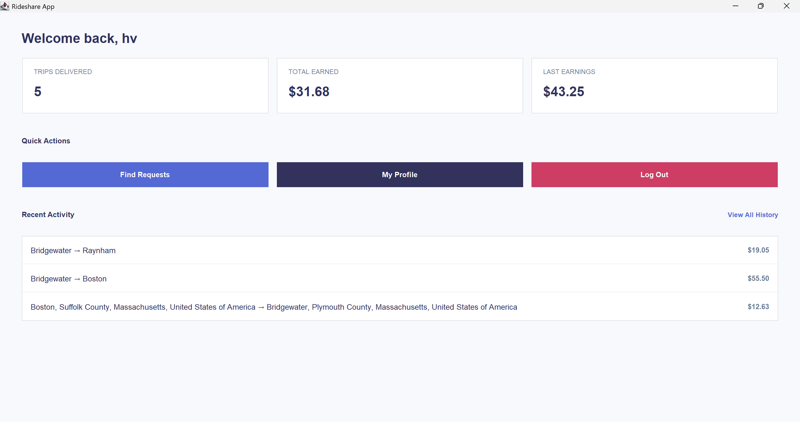
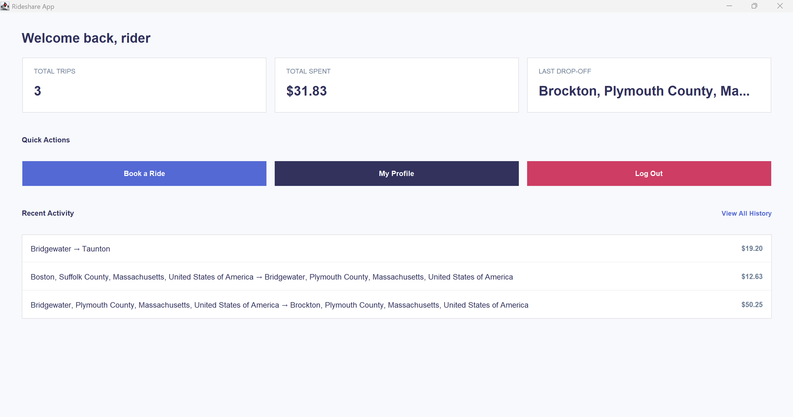
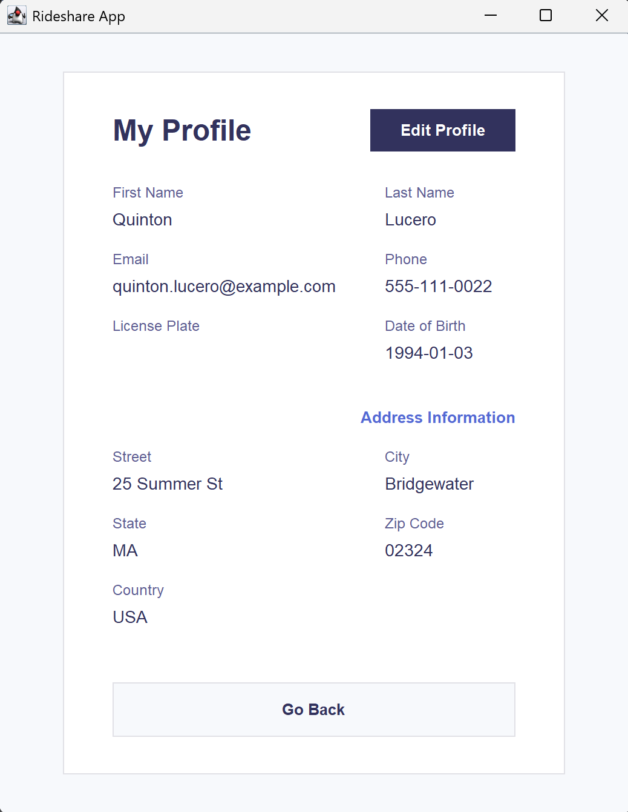

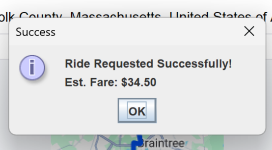
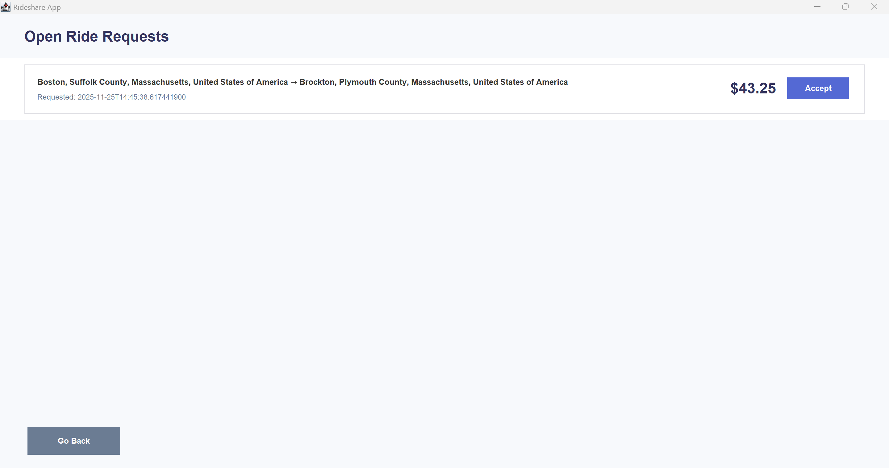

---

## Setup & Installation

### 🖥️ Prerequisites
Before running the project, make sure you have:
- **Java JDK 17+** installed  
- **SQLite** (comes prepackaged, no setup needed if using `sqlite-jdbc.jar`)  
- A compatible **IDE** such as IntelliJ IDEA  
- `sqlite-jdbc.jar` added to your project’s `/lib` folder  

### Installation Steps
1. **Clone the repository**
   ```bash
   git clone https://github.com/00ashvar/COMP-390.git
   cd COMP-390
   ```
2. **Open the project**
    - Launch your preferred IDE (e.g. **IntelliJ IDEA**).
    - Select **"Open Project"** and navigate to the cloned folder.
    - Ensure that the `sqlite-jdbc.jar` file is inside the `/lib` directory.
    - Add the JAR to your project classpath if it isn’t linked automatically.

3. **Set up the database**
    - The SQLite database file (e.g., `rideshare.db`) will be created locally automatically on first run.
    - The code will automatically execute schema creation when launched with (`schema.sql`).

4. **Run the program**
    - Locate and run the main entry point:
      ```bash
      RideshareApp.java
      ```  
    - The **Swing UI** should open automatically once the database connection is established.

---

## Technologies Used

| Category | Tool / Technology | Description |
|-----------|------------------|-------------|
| **Programming Language** | Java (JDK 17 or higher) | Core language used to implement the system logic |
| **GUI Framework** | Swing | Provides the graphical user interface for desktop interaction |
| **Database** | SQLite (via `sqlite-jdbc.jar`) | Lightweight, file-based relational database used for data persistence |
| **Database Connectivity** | JDBC | Standard Java API for connecting and executing SQL commands in SQLite |
| **Build & IDE** | IntelliJ IDEA | Development environment used to compile and run the project |
| **Version Control** | Git & GitHub | Used for version tracking and collaborative documentation |

---

**Notes**
- The project runs *entirely locally*; no external server or network connection required.
- All data is stored in a single SQLite database file (e.g., `rideshare.db`) inside the project directory.
- `sqlite-jdbc.jar` must be included in the project’s `/lib` folder and referenced in the classpath.

---

## Team & Credits

**Project Authors:**  
Alexandra Arbia, Lensi Gondaliya, Simao Rebelo, Hamilton Vargas, Esteban Torres  
Course: Software Engineering - COMP 390  
Instructor: Prof. Poonam Kumari 

